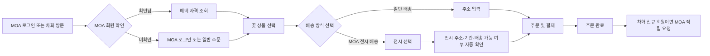

# ChaHwa x MOA Integration PRD v2

## 1. 목적

차화는 MOA와 연결된 꽃 선물 서비스다. 고객이 MOA 회원인지 안전하게 확인하고, 가입 및 구매 혜택을 적용하며, MOA 갤러리 전시 정보를 배송 주소로 활용해 전시장에 꽃을 보낼 수 있게 한다.

이 문서는 차화 MVP 이후의 MOA 연동 범위를 정의한다. 결제, 회원 식별, 혜택, 전시 배송을 하나의 주문 경험으로 연결하는 것이 목표다.

## 2. 목표와 비목표

### 목표

- MOA 회원 여부를 차화에서 안전하게 확인한다.
- MOA 신규 회원의 차화 첫 주문에 10% 할인을 적용한다.
- 차화 신규 회원의 첫 주문 완료 후 MOA 적립 혜택 10%를 지급한다.
- MOA 갤러리의 진행 중인 전시를 선택하면 전시장 주소를 자동으로 배송지에 적용한다.
- 전시 일정, 배송 가능 지역, 주문 마감 시간을 기준으로 주문 가능 여부를 즉시 보여 준다.
- 회원 정보와 주문 정보를 최소한으로, 서버 간 통신으로 처리한다.

### 비목표

- 브라우저에서 MOA 회원 식별값, 서명 키, 암호화 키를 저장하거나 검증하지 않는다.
- 차화가 MOA 비밀번호를 직접 수집하거나 보관하지 않는다.
- 전시 주소를 고객이 임의로 수정해 MOA 전시 배송으로 처리할 수 있게 하지 않는다.
- 첫 연동 단계에서 MOA 포인트의 잔액 조회·사용·복합 결제는 포함하지 않는다.

## 3. 사용자와 핵심 시나리오

| 사용자 | 시나리오 | 기대 결과 |
| --- | --- | --- |
| MOA 신규 회원 | MOA에서 차화로 이동해 첫 꽃을 주문한다. | MOA 신규 회원 10% 할인 혜택을 확인하고 적용한다. |
| 차화 신규 회원 | 차화에서 회원 가입 후 첫 주문을 완료한다. | 주문 완료 후 MOA에 10% 적립 혜택이 지급된다. |
| 전시 관람객 | MOA 전시 페이지에서 차화 선물을 선택한다. | 전시 장소와 기간이 배송 정보에 자동 반영된다. |
| 일반 고객 | 차화에서 직접 상품을 고른다. | 일반 배송지 입력 또는 MOA 전시 배송을 선택할 수 있다. |

## 4. 경험 흐름



## 5. 기능 요구사항

### 5.1 MOA 회원 확인

- 차화는 MOA 로그인 콜백 또는 MOA가 발급한 일회성 연동 토큰으로 회원을 확인한다.
- 토큰은 차화 서버에서만 검증한다. 프런트엔드는 성공·실패와 표시용 회원 상태만 받는다.
- 토큰은 짧은 만료 시간, 발급자, 대상 서비스, 발급 시간, 고유 ID를 포함해야 한다.
- 차화는 MOA의 내부 회원 번호 대신 연동 전용 `moa_member_id` 또는 불투명 식별자를 사용한다.
- 로그아웃, 토큰 만료, 검증 실패 시 혜택은 적용하지 않고 일반 주문으로 진행할 수 있다.

### 5.2 혜택 정책

| 혜택 | 대상 | 적용 시점 | 기본 정책 |
| --- | --- | --- | --- |
| MOA 가입 축하 할인 | MOA 신규 회원 | 차화 첫 결제 전 | 주문 상품 금액의 10%, 최대 할인 한도는 운영 설정 |
| 차화 가입 축하 적립 | 차화 신규 회원 | 결제 완료 후 | 결제 완료 금액의 10%를 MOA 적립 혜택으로 지급 |

- 두 혜택은 기본적으로 한 주문에 중복 적용하지 않는다. 운영 정책 변경 시 중복 가능 여부를 설정값으로 관리한다.
- 배송비, 포장 추가금, 취소 수수료는 할인·적립 계산 기준에서 제외한다.
- 할인은 결제 전 MOA 서버로 자격을 확인한 뒤 주문에 잠근다.
- 적립은 결제 성공 후 비동기 요청으로 지급한다. 지급 실패 시 재시도 큐에 넣고 운영자가 조회할 수 있어야 한다.
- 전액 취소·환불 시 적립 혜택을 회수한다. 부분 취소의 계산 방식은 결제 정책과 함께 확정한다.
- 동일 MOA 회원이 혜택을 반복 수령하지 않도록 MOA와 차화 모두에 혜택 발급 이력을 남긴다.

### 5.3 MOA 전시 배송

- 고객은 상품 상세 또는 주문서에서 `일반 배송`과 `MOA 전시 배송`을 선택할 수 있다.
- MOA 전시 배송 선택 시 진행 중이거나 예약 가능한 전시 목록을 불러온다.
- 전시 선택 후 아래 정보는 차화가 자동 입력하고 수정 불가 상태로 표시한다.
  - 갤러리명 및 전시명
  - 전시장 배송 주소
  - 배송 가능 날짜와 시간대
  - 수령 담당자 또는 현장 연락처
  - 전시 배송 메모
- 전시 종료 이후, 설치·철수 시간, 당일 배송 마감, 차화 배송 권역 밖인 경우에는 주문을 막고 가능한 대안을 안내한다.
- 전시 정보가 변경되거나 종료된 뒤 주문을 결제하려 하면 결제 직전에 최신 정보를 다시 검증한다.
- 전시 배송은 일반 주소 입력란을 숨기되, 카드 문구와 받는 분 정보는 주문자가 입력할 수 있게 한다.

### 5.4 차화 주문과 MOA 데이터 동기화

- 차화 주문 완료 시 MOA에 전송하는 정보는 최소화한다.
  - MOA 연동 식별자
  - 차화 주문 번호
  - 혜택 발급 대상 금액
  - 주문 상태와 취소 상태
  - 멱등성 키
- 꽃 구성, 카드 문구, 수령인 연락처, 상세 주소는 MOA 적립 처리 목적상 전송하지 않는다.
- MOA는 적립 처리 결과와 혜택 발급 식별자를 반환한다.

## 6. API 계약 초안

실제 엔드포인트, 인증 수단, 필드명은 MOA 개발팀과 확정한다. 아래는 차화 구현을 위한 최소 계약이다.

### A. 회원 연동 토큰 검증

`POST /v1/integrations/chahwa/member/verify`

요청:

```json
{
  "token": "short_lived_moa_signed_token",
  "audience": "chahwa"
}
```

응답:

```json
{
  "member_id": "opaque_member_reference",
  "is_moa_member": true,
  "is_new_member": true,
  "eligible_benefits": ["moa_welcome_discount"]
}
```

### B. 전시 및 배송 가능 정보 조회

`GET /v1/galleries/exhibitions?status=active&delivery_date=YYYY-MM-DD`

응답:

```json
{
  "exhibitions": [
    {
      "exhibition_id": "exh_123",
      "gallery_name": "MOA 성수",
      "title": "봄의 표정",
      "starts_at": "2026-08-01T10:00:00+09:00",
      "ends_at": "2026-08-31T18:00:00+09:00",
      "delivery": {
        "available": true,
        "address": "서울시 성동구 예시로 00",
        "postal_code": "00000",
        "available_slots": ["10:00-13:00", "14:00-17:00"],
        "cutoff_at": "2026-08-31T11:00:00+09:00",
        "recipient_contact": "delivery_contact_reference"
      }
    }
  ]
}
```

### C. 할인 자격 잠금

`POST /v1/integrations/chahwa/benefits/reserve`

```json
{
  "member_id": "opaque_member_reference",
  "benefit_type": "moa_welcome_discount",
  "order_reference": "chahwa_checkout_123",
  "eligible_amount": 69000,
  "idempotency_key": "uuid"
}
```

- 응답은 할인 금액, 만료 시각, 혜택 예약 ID를 포함한다.
- 차화는 결제 성공 후 예약을 확정하고 결제 실패·시간 초과 시 해제한다.

### D. 차화 가입 축하 적립 지급

`POST /v1/integrations/chahwa/rewards/grant`

```json
{
  "member_id": "opaque_member_reference",
  "order_id": "chahwa_order_20260720_001",
  "reward_type": "chahwa_signup_reward",
  "eligible_amount": 69000,
  "reward_rate": 0.1,
  "idempotency_key": "uuid"
}
```

- MOA는 중복 요청에 같은 결과를 반환해야 한다.
- 차화는 MOA의 지급 ID와 상태를 저장한다.

## 7. 차화 데이터 모델 추가

```ts
type MoaMemberLink = {
  chahwaUserId: string;
  moaMemberReference: string;
  verifiedAt: string;
  tokenExpiresAt?: string;
};

type BenefitLedger = {
  id: string;
  chahwaOrderId?: string;
  moaMemberReference: string;
  benefitType: "moa_welcome_discount" | "chahwa_signup_reward";
  status: "reserved" | "granted" | "reversed" | "failed";
  eligibleAmount: number;
  benefitAmount: number;
  idempotencyKey: string;
  moaTransactionId?: string;
};

type ExhibitionDelivery = {
  exhibitionId: string;
  galleryName: string;
  exhibitionTitle: string;
  addressSnapshot: string;
  deliverySlot: string;
  availabilityCheckedAt: string;
};
```

주문 데이터에는 일반 배송지 또는 `ExhibitionDelivery` 중 하나만 저장한다. 전시 배송에도 결제 시점의 주소 스냅샷을 남겨, 이후 전시 데이터가 바뀌어도 주문 이력을 보존한다.

## 8. 보안과 개인정보

- MOA와 차화 API는 서버 간 HTTPS 통신만 사용한다.
- 토큰 검증에는 서명 검증용 공개키(JWKS) 또는 서버 간 토큰 검증 API를 사용한다.
- 연동 토큰은 짧은 만료 시간과 일회성 `jti`를 사용하며 재사용을 막는다.
- API 호출은 서비스별 자격 증명, 요청 서명 또는 mTLS 중 MOA 표준에 맞는 방식을 사용한다.
- 회원 식별자, 혜택 이력, 주문 상태 접근은 역할 기반 권한으로 제한하고 감사 로그를 남긴다.
- 개인정보처리방침과 주문 동의 화면에 MOA 연동 목적, 전송 항목, 보유 기간을 명시한다.
- 전화번호·상세 주소·카드 문구는 MOA 혜택 지급 API에 보내지 않는다.

## 9. 화면 요구사항

### 상품 상세

- MOA 회원 확인 상태와 적용 가능한 혜택을 가격 근처에 명확히 표시한다.
- 미로그인 상태에서는 `MOA 회원 혜택 확인하기` 버튼을 제공한다.
- 혜택이 적용된 경우 정상가, 할인 금액, 최종 예상 금액을 구분해 표시한다.

### 주문서

- 배송 방식 선택: `일반 배송` / `MOA 전시 배송`.
- 전시 배송 선택 시 전시 검색·선택 영역, 자동 입력된 배송 정보, 배송 가능 상태를 표시한다.
- 배송 불가 시 결제 버튼을 비활성화하고 사유와 일반 배송 전환 버튼을 제공한다.
- 적립은 결제 전 `주문 완료 후 MOA 혜택 10% 적립 예정`으로 안내하고, 결제 후 최종 지급 결과를 표시한다.

### 주문 완료

- 할인 적용 내역과 적립 예정 또는 지급 완료 상태를 주문 번호와 함께 표시한다.
- 적립 처리 지연 시 “확인 중”으로 표시하고 알림 또는 마이페이지에서 상태를 갱신한다.

## 10. 운영 정책 결정 항목

- MOA 신규 회원의 정의: 가입 후 며칠 이내인지, 첫 차화 주문 전까지인지.
- 차화 신규 회원의 정의: 차화 회원 가입만으로 충분한지, 첫 결제 완료가 필요한지.
- 10%의 기준 금액과 최대 할인·적립 한도.
- 동일 주문에서 할인과 적립의 중복 가능 여부.
- 부분 취소, 전체 취소, 배송 실패, 교환 시 혜택 회수 규칙.
- 전시 배송의 수령 주체와 부재·파손 시 책임 범위.
- 전시 정보 변경 알림의 소유 주체와 SLA.

## 11. 단계별 구현

### Phase 1: 연동 기반

- MOA 로그인 콜백 또는 토큰 검증.
- 차화 회원과 MOA 연동 식별자 연결.
- 회원 혜택 상태 조회와 화면 표시.
- 전시 목록 및 배송 가능 여부 읽기 전용 연동.

### Phase 2: 주문 혜택

- MOA 신규 회원 10% 할인 예약·확정·해제.
- 차화 신규 회원 10% 적립 요청·재시도·회수.
- 혜택 원장과 운영자 조회 화면.

### Phase 3: 전시 배송 자동화

- 전시 배송 방식과 주소 자동 적용.
- 전시 일정 및 배송 슬롯 실시간 검증.
- 주문 완료 후 전시 현장 알림 또는 배송 파트너 연동.

## 12. 수용 기준

- MOA 회원 정보는 브라우저에서 직접 검증하거나 장기 저장하지 않는다.
- 자격이 있는 MOA 신규 회원에게만 10% 할인이 한 번 적용된다.
- 차화 신규 회원의 적립 요청은 주문 재시도에도 중복 지급되지 않는다.
- 전시 배송 주문은 고객 주소 입력 없이 유효한 전시장 주소와 배송 슬롯을 사용한다.
- 전시 종료·배송 마감·배송 불가 상태에서는 결제할 수 없다.
- 주문 취소 시 관련 혜택 상태가 정책에 맞게 반전된다.
- MOA API 장애 시 일반 주문은 가능하되, 혜택·전시 배송 기능의 제한 상태를 명확히 안내한다.

## 13. Codex 자체 구현 전제

이 프로젝트는 MOA 개발팀에 API를 요청하는 방식이 아니라, Codex에서 MOA와 차화의 연동 계층을 직접 구현하는 방식으로 진행한다. 따라서 아래 범위를 별도의 구현 작업으로 포함한다.

1. MOA와 차화의 회원·주문·혜택·전시 데이터를 어느 공통 데이터베이스에서 관리할지 결정한다.
2. 공통 계정 테이블과 서비스별 프로필 테이블을 분리하고, 서비스 간 식별자는 내부 UUID 또는 불투명 참조값으로 연결한다.
3. MOA 로그인·차화 로그인·서비스 간 SSO를 직접 구현하고, 브라우저에는 세션 쿠키만 노출한다.
4. 혜택·주문·전시 배송의 API 라우트, 권한 검사, 멱등성, 감사 로그를 직접 작성한다.
5. MOA 전시 관리 화면에서 전시명·주소·기간·배송 슬롯·수령 담당자를 등록하고 차화 주문서가 읽도록 한다.
6. 차화 관리자에서 회원 링크, 혜택 원장, 전시 배송 주문, 실패한 동기화 작업을 조회·재처리한다.
7. 개발·스테이징·운영 환경과 테스트 회원·테스트 주문·테스트 전시 데이터를 분리한다.

단, 현재 작업공간에는 차화 코드만 있으므로 MOA의 기존 회원·주문·전시 데이터가 별도 시스템에 존재한다면 이 저장소만으로 기존 MOA 데이터를 자동 연결할 수 없다. 이 경우 둘 중 하나를 선택해야 한다.

- MOA 코드와 데이터베이스를 같은 Codex 작업공간에 가져와 두 서비스를 함께 수정한다.
- 기존 MOA가 사용하는 데이터베이스 스키마와 인증 방식에 맞춘 호환 API를 먼저 만들고, 이후 차화를 연결한다.

기존 MOA 시스템의 소스·스키마·인증 정보가 없는 상태에서는 실제 회원 여부 확인과 전시 주소 자동 배송을 운영 데이터로 검증할 수 없으며, 현재 차화 MVP의 로컬 샘플 데이터는 대체 수단이 아니다.

## 14. Codex에서 직접 결정해야 할 기술 항목

### 14.1 공통 계정과 인증

- 공통 `users`와 서비스별 `moa_profiles`, `chahwa_profiles`를 분리한다.
- 회원 링크는 `user_id`, `service`, `external_ref`, `linked_at`, `unlinked_at`로 관리한다.
- 비밀번호는 직접 저장하지 않고 검증된 인증 라이브러리와 해시 방식을 사용한다.
- 세션은 HttpOnly·Secure·SameSite 쿠키로 관리하고 서비스 간 토큰에는 issuer, audience, expiry, nonce를 검증한다.
- MOA에서 차화로, 차화에서 MOA로 이동하는 redirect URI를 allowlist로 제한한다.
- 계정 연결·연결 해제·탈퇴 시 두 서비스의 상태 전이를 정의한다.
- 이메일·전화번호 중복 계정 병합은 자동 처리하지 않고 본인 확인과 명시적 동의를 거친다.

### 14.2 데이터와 운영 경계

- 회원, 주문, 상품, 결제, 배송, 전시, 혜택, 문의, 감사 로그의 소유 서비스를 지정한다.
- 각 테이블에 `created_at`, `updated_at`, 상태 변경자, 원천 서비스, 삭제·분리보관 상태를 둔다.
- 주문과 결제 금액은 결제 시점 스냅샷으로 보존한다.
- MOA와 차화의 상태가 달라질 때 어느 시스템을 기준으로 복구할지 정한다.
- API 실패 작업은 재시도 큐와 dead-letter 상태로 남기고 운영자가 재처리할 수 있게 한다.
- 모든 외부·내부 API에 idempotency key를 적용한다.

### 14.3 결제 구현

- Codex에서 PG사를 직접 구현하는 것이 아니라 PG의 공식 연동 모듈을 사용한다.
- 결제 승인 비밀키는 환경변수·호스팅 Secret으로만 관리한다.
- 결제 성공 redirect만 믿지 말고 서버 웹훅과 PG 거래 조회로 최종 상태를 확정한다.
- 웹훅 서명, 타임스탬프, 중복 이벤트, 순서가 뒤바뀐 이벤트를 검증한다.
- 주문 금액과 PG 승인 금액이 다르면 주문을 보류하고 자동 환불·운영 알림을 실행한다.
- 테스트 모드와 운영 모드의 키·웹훅 URL·DB를 분리한다.

### 14.4 관리자와 보안 운영

- 관리자 계정은 일반 고객 계정과 분리하거나 별도 역할·MFA를 적용한다.
- 환불, 적립금 조정, MOA 혜택 수동 지급, 개인정보 조회·다운로드는 최소 권한으로 제한한다.
- 관리자 화면에서 개인정보를 기본 마스킹한다.
- 비정상 로그인, 대량 조회, 반복 환불, 혜택 중복 요청을 탐지한다.
- 백업·복구 테스트, 키 교체, 로그 보존, 장애 대응 연락망을 운영 문서로 만든다.

### 14.5 메시지·파일·외부 서비스

- 이메일, SMS, 카카오 알림톡, 배송 사진 저장소를 어느 서비스가 소유하는지 결정한다.
- 배송 사진 원본과 고객 노출용 사본의 접근 URL·만료 시간을 분리한다.
- 이미지 업로드 파일의 확장자·MIME·크기·악성 파일 검사를 추가한다.
- SMS·알림톡 발송 실패와 재전송을 기록하고 마케팅 수신 동의와 주문 알림을 분리한다.
- 분석 도구·오류 모니터링·메일·스토리지의 개인정보 국외 이전 및 수탁 관계를 점검한다.

## 15. Codex 실행 순서

1. MOA 저장소·인증·DB·배포 환경을 현재 작업공간에 연결한다.
2. 공통 계정·서비스별 프로필·동의·탈퇴·분리보관 스키마를 만든다.
3. MOA 전시 관리와 차화 상품·주문·배송 모델을 만든다.
4. 차화 회원·비회원 주문, PG 테스트 결제, 주문 상태, 환불을 구현한다.
5. 관리자 인증·권한·결제 대시보드·주문 처리 화면을 구현한다.
6. MOA 회원 링크, 10% 할인, 10% 적립 원장을 연결한다.
7. 전시 선택과 자동 배송지, 배송 슬롯 검증을 연결한다.
8. Q&A·FAQ·후기·배송 사진·알림을 구현한다.
9. 탈퇴·철회·분리보관·파기 배치와 감사 로그를 검증한다.
10. 테스트 결제와 실패·재시도·환불·장애 복구 시나리오를 통과한 후 운영 키를 적용한다.

## 16. 개인정보 처리 법적·운영 검토

### 14.1 기본 판단

MOA와 차화가 서로 다른 법인 또는 별도 개인정보처리자라면, MOA 회원 여부·연동 식별자·혜택 자격을 차화에 전달하는 행위는 공유를 포함하는 개인정보의 제3자 제공으로 검토해야 한다. 개인정보 보호법 제17조는 제3자 제공 시 제공받는 자, 이용 목적, 항목, 보유·이용 기간, 거부권과 불이익을 알리도록 요구한다.

`암호화된 값`이라는 이유만으로 개인정보가 아닌 것이 되지는 않는다. 차화 또는 MOA가 복호화하거나 다른 정보와 결합해 개인을 다시 알아볼 수 있다면 개인정보 또는 가명정보로 보고 처리 근거와 보호조치를 설계해야 한다. 따라서 단순히 이메일·전화번호를 암호화해 양쪽에 저장하는 방식은 기본안으로 채택하지 않는다.

반대로 두 사이트가 동일한 개인정보처리자에 속하는지, 실제로 어느 법인이 회원 혜택과 주문을 결정하는지는 법인·계약 구조를 확인해야 한다. 같은 법인 내부 이용인지, 독립된 두 처리자 간 제공인지에 따라 고지·동의·계약이 달라진다.

### 14.2 권장 연동 구조

고객 식별정보를 직접 교환하는 방식보다 MOA가 인증을 완료한 뒤 차화가 일회성 코드로 서버 간 교환하는 방식을 권장한다.

1. 고객이 차화에서 `MOA 회원 혜택 확인`을 선택한다.
2. MOA가 로그인과 동의를 처리하고 차화 전용 일회성 authorization code를 발급한다.
3. 차화 서버가 MOA 서버에 코드를 교환한다.
4. MOA는 이름·이메일·전화번호 대신 연동 전용 불투명 식별자와 필요한 상태값만 반환한다.
5. 차화는 혜택 적용에 필요한 최소 상태만 단기간 보유한다.

이 구조에서도 두 서비스 간 개인정보 제공이 완전히 사라지는 것은 아니다. 다만 브라우저와 URL에 회원 식별값을 노출하지 않고, 직접 식별정보와 비밀번호를 교환하지 않으며, 제공 항목을 최소화할 수 있다.

### 14.3 처리자 역할 구분

| 상황 | 우선 검토할 관계 | 필요한 조치 |
| --- | --- | --- |
| MOA와 차화가 각자의 목적과 정책으로 회원 혜택을 운영 | 독립된 개인정보처리자 간 제3자 제공 | 각 서비스의 제공 동의, 처리방침, 제공 항목·기간·철회 절차 |
| 한 회사가 다른 사이트에 단순히 주문 처리를 맡김 | 개인정보 처리위탁 | 위탁계약, 목적 외 이용 금지, 보호조치, 수탁자 공개·관리 |
| MOA가 전시 주소와 배송 지시를 정하고 차화가 그대로 수행 | 위탁 또는 공동 의사결정 여부 검토 | 역할·책임·사고 대응·정보주체 요구 처리 주체를 계약으로 명확화 |
| 고객이 MOA 전시 배송을 선택하고 차화가 독립적으로 상품을 판매 | 제3자 제공 가능성이 높음 | 전시 배송 목적의 별도 고지·동의와 차화의 처리 근거 검토 |

처리위탁과 제3자 제공을 문구만으로 선택하지 않는다. 누가 처리 목적과 수단을 결정하는지, 누가 고객에게 서비스를 제공하고 혜택을 판단하는지에 따라 실제 관계를 확정한다. 처리위탁으로 판단하는 경우에는 개인정보 보호법 제26조에 따른 문서화와 공개·감독 요건을 반영한다.

### 14.4 동의 화면과 처리방침

회원가입 약관에 한 줄로 묶지 않고, 아래 동의를 목적별로 분리한다.

- `MOA 회원 혜택 확인 및 차화 제공`: MOA가 차화에 연동 전용 식별자와 혜택 자격을 제공하는 목적.
- `차화 신규 회원 혜택의 MOA 적립`: 차화가 MOA에 적립 지급에 필요한 최소 식별자와 주문·적립 금액을 제공하는 목적.
- `MOA 전시 배송`: 고객이 선택한 전시의 배송을 위해 전시장 주소, 배송 시간대, 수령 관련 정보를 이용하는 목적.

각 동의 항목에는 최소한 다음을 명시한다.

- 제공받는 자: 법인명과 서비스명
- 제공 목적: 회원 혜택 확인, 할인 적용, 적립 지급, 전시 배송
- 제공 항목: 연동 식별자, 회원 상태, 주문 참조값, 적립 대상 금액, 전시 배송 정보
- 보유·이용 기간: 목적 달성 시까지 또는 적용되는 법정 보존기간
- 동의 거부권과 거부 시 영향: 일반 차화 주문은 가능하지만 MOA 혜택 또는 전시 배송을 이용할 수 없음
- 철회 방법: 차화 계정 설정, MOA 계정 설정, 고객센터 등 실제 가능한 경로

개인정보 보호위원회는 제3자 제공은 계약 이행을 이유로 처리하더라도 동의가 필요한 항목으로 안내하고 있으므로, 혜택과 전시 배송의 제3자 제공 여부는 별도 동의를 기본값으로 설계한다.

### 14.5 데이터 최소화와 보유

기본적으로 양쪽 서비스 간 공유하지 않는 항목:

- 비밀번호, 주민등록번호, 결제수단 정보
- 차화 주문에 필요하지 않은 MOA 프로필 정보
- 혜택 확인에 필요하지 않은 이름·전화번호·이메일
- 전시 배송에 필요하지 않은 고객의 상세 주소

기본 공유 항목:

- 일회성 연동 코드 또는 연동 전용 불투명 식별자
- 회원 자격 및 혜택 상태
- 차화 주문 참조값과 혜택 계산 금액
- 멱등성 키와 MOA 혜택 거래 ID
- 고객이 선택한 전시 ID, 전시장 주소 스냅샷, 배송 가능 시간대

연동 식별자와 토큰은 목적 달성·철회·탈퇴 시점을 기준으로 삭제 또는 비활성화한다. 주문·결제·혜택 거래 원장은 관련 법정 보존기간과 회계·소비자 분쟁 대응 기간을 따로 검토한 뒤 보유기간을 확정한다. PRD 단계에서 임의의 보존기간을 정해두지 않고 법무·개인정보 담당자와 확정한다.

### 14.6 정보주체 권리와 운영 대응

- 고객이 동의를 철회하면 신규 혜택 확인·적립 요청을 중지한다.
- 이미 완료된 할인·적립 거래는 철회 시점과 환불 정책에 따라 별도 처리하고, 이를 사전에 안내한다.
- 고객이 열람·정정·삭제·처리정지를 요청할 때 MOA와 차화 중 어느 쪽이 접수하고 어느 쪽이 전달할지 정한다.
- 회원 탈퇴 시 연동 링크와 미사용 토큰을 삭제하고, 법정 보존 대상 거래 원장에는 필요한 최소 정보만 남긴다.
- 개인정보 유출, 잘못된 할인, 중복 적립, 전시장 오배송이 발생하면 양사 공동 사고 대응 연락망과 통지 책임을 작동시킨다.

### 14.7 출시 전 필수 확인

- MOA와 차화의 법인 및 개인정보처리자 관계
- 양사 개인정보 보호책임자와 사고 대응 연락처
- 회원 연동·혜택·전시 배송별 처리 근거와 동의 문안
- 양쪽 개인정보 처리방침 및 제3자 제공/위탁 현황 반영
- 토큰 서명·키 교체·폐기·재전송 방지 방식
- 개인정보 국외 이전 여부와 클라우드·분석·메일·고객상담 솔루션의 하위 처리자
- 탈퇴·동의 철회·정정·삭제 요청의 양사 처리 SLA
- 실제 운영자와 배송 파트너가 전시장 수령인 정보를 볼 수 있는 범위

이 항목들은 법률 자문을 대체하지 않으며, 실제 출시 전 양사의 개인정보 담당자 또는 전문 법률 검토를 거쳐 확정한다.

### 공식 기준

- [개인정보 보호법 제17조: 개인정보의 제공](https://www.law.go.kr/lsLinkCommonInfo.do?chrClsCd=010202&lsJoLnkSeq=1029334403)
- [개인정보 보호법 제18조: 목적 외 이용·제공 제한](https://www.law.go.kr/LSW/lsLawLinkInfo.do?chrClsCd=010202&lsJoLnkSeq=900078309)
- [개인정보 보호법 제26조: 업무위탁에 따른 개인정보 처리 제한](https://www.law.go.kr/lsLawLinkInfo.do?chrClsCd=010202&lsJoLnkSeq=900079876)
- [개인정보 보호위원회: 개인정보 처리방침 작성지침 개정 안내](https://m.pipc.go.kr/np/cop/bbs/selectBoardArticle.do?bbsId=BS074&mCode=C020010000&nttId=11133)

## 17. 일반 온라인 꽃 주문몰 필수 범위

MOA 연동만으로는 실제 주문몰을 운영할 수 없다. 꽃집청년들의 공개 사이트에서 확인되는 상품 카테고리, 비회원 주문, 간편결제, 배송 조회, 배송 사진, 회원 적립·쿠폰, 마이페이지, FAQ·1:1문의·상품문의·후기·카카오 상담 흐름을 차화의 기준 범위로 삼는다. 꽃집청년들은 꽃선물·개업화분·승진/취임·결혼/장례·DIY·정기구독·기업제휴 등 목적과 상품을 함께 분류하고 있다. ([공식 사이트](https://www.f-mans.com/), [이용 가이드](https://www.f-mans.com/service/guide), [FAQ](https://f-mans.com/board/?id=faq))

### 15.1 회원가입·로그인·탈퇴

- 이메일 또는 휴대전화 기반 회원가입과 본인 확인.
- MOA 연동 로그인, SNS 로그인 확장 지점, 비밀번호 재설정.
- 비회원 주문과 주문번호·주문자 연락처 기반 주문 조회.
- 회원가입 시 필수 약관, 개인정보 수집·이용, 선택 마케팅 동의를 분리한다.
- MOA 혜택 동의는 차화 회원가입 동의와 분리한다.
- 마이페이지에서 주문, 배송지, 쿠폰, 적립금, 문의, 후기, 개인정보를 관리한다.
- 회원 탈퇴 전 미사용 쿠폰·적립금·진행 중 주문·MOA 연동 해제 내용을 안내한다.
- 탈퇴 후 즉시 파기할 계정 정보와 법정 보존해야 하는 주문·결제·분쟁 기록을 분리한다.
- 탈퇴 계정의 로그인, 적립금 사용, 쿠폰 사용, MOA 혜택 재발급을 차단한다.

### 15.2 상품·카탈로그

- 꽃 선물, 부케, 꽃바구니, 플라워 박스, 개업화분, 관엽/난, 축하화환, 근조화환, 기업·행사, 정기구독 카테고리.
- 목적 기반 탐색: 생일, 기념일, 축하, 감사, 조문, 개업, 승진, 전시·행사.
- 상품별 가격, 옵션, 꽃 구성, 이미지, 카드·리본 문구, 배송 가능 지역, 주문 마감, 품절 상태.
- 생화 특성상 실제 상품이 사진과 달라질 수 있는 범위와 소재 변경 정책을 상품 상세에 표시한다.
- 검색, 정렬, 가격·카테고리 필터, 최근 본 상품, 찜 목록.
- 상품 문의, 후기 작성 가능 조건, 배송 완료 사진 노출 동의와 비공개 처리.
- 상품·가격·옵션·재고·노출 여부를 관리자에서 변경하되 이미 결제된 주문의 가격과 구성은 주문 시점 스냅샷으로 보존한다.

### 15.3 장바구니·주문서

- 여러 상품과 옵션을 장바구니에 담고 수량을 변경한다.
- 상품별 배송일, 배송 방식, 카드 문구, 리본 문구, 보내는 분·받는 분 정보를 입력한다.
- 주문자 정보와 수령인 정보를 분리한다. 익명 배송을 선택하면 배송 파트너에게 불필요한 주문자 정보를 전달하지 않는다.
- 일반 배송과 MOA 전시 배송을 분리하고, 배송지·배송일·배송 슬롯의 유효성을 결제 직전에 다시 확인한다.
- 할인쿠폰, MOA 할인, 적립금 사용, 배송비, 옵션 추가금, 최종 결제금액을 분리 표시한다.
- 주문 전 상품명, 수량, 배송일, 수령인, 주소, 결제금액을 최종 확인하게 한다.
- 결제 실패 후 주문이 중복 생성되지 않도록 결제 세션과 주문 상태를 멱등 처리한다.

### 15.4 결제와 결제 대시보드

#### 고객 결제

- 국내 카드, 간편결제, 계좌이체, 무통장입금, 필요 시 해외 카드 결제.
- 결제대행사(PG)는 차화가 직접 카드번호를 보관하지 않는 hosted checkout 또는 토큰 결제 방식을 우선한다.
- 결제 성공·실패·취소·부분취소·환불·입금대기·입금확인 상태를 웹훅으로 동기화한다.
- 결제 금액과 주문 금액을 서버에서 재계산하고, 클라이언트가 보낸 가격을 신뢰하지 않는다.
- 카드영수증, 현금영수증, 세금계산서 또는 거래명세서 요청을 처리한다.
- 결제 완료·입금 확인·환불 완료 알림을 이메일, 문자, 카카오 등 동의된 채널로 전송한다.

#### 관리자 결제 대시보드

- 기간·결제수단·상태·주문번호·고객명으로 검색.
- 결제 승인 금액, 할인, 쿠폰, 적립금, 배송비, PG 수수료, 환불액, 실결제액을 구분.
- 입금대기 주문의 입금 확인과 미입금 자동 취소.
- 결제 취소·부분환불 승인 권한 분리와 사유 기록.
- PG 거래 ID, MOA 혜택 거래 ID, 차화 주문 ID를 연결해 추적.
- 일별 매출, 환불, 실패, 미입금, 미처리 주문을 집계하되 결제수단 원문·카드번호는 저장하지 않는다.
- 관리자 다운로드 파일에도 최소 정보와 권한 검사를 적용한다.

### 15.5 주문·배송 운영

- 주문 상태: 주문접수 → 결제완료/입금대기 → 제작중 → 배송중 → 배송완료 → 취소/환불.
- 당일배송·예약배송·택배배송·전시배송을 구분한다.
- 배송 가능 지역, 추가 배송비, 도서산간, 배송 마감 시간, 휴일·기상 예외를 정책으로 관리한다.
- 꽃집청년들처럼 배송 조회와 배송 완료 사진 요청/전송 흐름을 제공한다.
- 수령인 부재, 주소 오류, 수령 거부, 꽃 상태 문제, 배송 지연에 대한 처리 기준과 고객 안내 문구를 마련한다.
- 전시배송은 전시장 주소를 자동 사용하되 결제 직전에 전시 상태를 재검증한다.
- 배송 파트너가 보는 정보는 배송에 필요한 수령인·주소·연락처·배송 메모로 제한한다.
- 관리자에서 제작 지시서, 카드·리본 문구, 배송 라벨, 배송 사진을 관리한다.

### 15.6 취소·교환·환불

- 생화는 제작·출고·배송 진행 여부에 따라 취소 가능 시간이 달라질 수 있으므로 상품과 주문 단계에서 명확히 고지한다.
- 주문 취소, 결제 취소, 배송 전 환불, 배송 후 환불, 부분환불을 별도 상태로 관리한다.
- 고객 귀책과 차화 귀책에 따른 배송비 부담 기준.
- 잘못 배송, 상품 하자, 품질 저하, 수령 거부, 주소 오류의 증빙과 사진 제출 흐름.
- 환불이 PG에서 성공했는지와 차화 주문 상태가 일치하는지 검증한다.
- 할인·쿠폰·적립금·MOA 혜택을 환불 금액에 맞춰 복원하거나 회수한다.
- 환불 처리 결과와 예상 소요일을 고객에게 안내한다.

### 15.7 회원 혜택·쿠폰·적립금

- 회원가입 축하 혜택, 기본 적립, 이벤트 적립, 쿠폰, MOA 연동 혜택을 각각 원장으로 기록한다.
- 적립은 결제 완료가 아니라 배송 완료 등 정책상 확정 시점에 지급한다.
- 적립금 사용·소멸·환불 회수·중복 지급 방지.
- 쿠폰 발급, 사용 조건, 유효기간, 중복 사용, 사용 취소 복원.
- MOA 10% 할인과 차화 10% 적립의 적용 순서와 기준 금액을 주문서에 표시한다.
- 관리자 수동 지급·회수는 사유와 담당자를 감사 로그로 남긴다.

### 15.8 Q&A·고객센터·콘텐츠

- FAQ를 주문·결제, 배송, 상품, 회원, 포인트·이벤트, 교환·환불로 분류한다.
- 1:1 문의와 상품 문의를 구분하고 로그인 회원의 문의 이력을 마이페이지에서 제공한다.
- 문의 유형별 담당자, 상태(접수·답변중·답변완료), 내부 메모, 답변 템플릿.
- 카카오톡, 전화, 이메일 문의와 사이트 문의의 주문번호 연계.
- 공지사항, 배송 공지, 이벤트, 매거진, 전시 안내, 기업 제휴 문의.
- 문의 본문에 주민등록번호·카드번호·비밀번호를 입력하지 않도록 안내하고, 입력 시 마스킹·삭제 절차를 둔다.
- Q&A 답변에 포함된 개인정보와 첨부파일의 접근 권한 및 보유기간을 관리한다.

### 15.9 관리자 대시보드

- 주문·결제·배송·환불·회원·상품·재고·쿠폰·적립금·Q&A·후기·MOA 연동을 한 화면에서 검색한다.
- 역할을 운영자, CS, 제작자, 배송 담당자, 재무 담당자로 분리한다.
- 관리자 로그인에 MFA 또는 강한 추가 인증을 적용하고, 권한별 메뉴·필드 접근을 제한한다.
- 회원 검색 시 이름·전화번호 전체 노출을 피하고 필요한 경우 마스킹한다.
- 조회·다운로드·수정·환불·혜택 수동 지급을 모두 감사 로그에 기록한다.
- 개인정보·결제정보·주문정보의 접근 로그를 보관하고 이상 접근을 탐지한다.
- 장애·PG 웹훅 실패·MOA 연동 실패·배송 지연을 운영 알림으로 보낸다.

### 15.10 필수 정책·법정 문서

- 이용약관
- 개인정보처리방침
- 개인정보 제3자 제공 동의서
- 개인정보 처리위탁 현황 및 위탁계약
- 마케팅 정보 수신 동의
- 배송·교환·환불 정책
- 결제·현금영수증·세금계산서 안내
- 사업자 정보, 통신판매업 신고 정보, 고객센터 정보
- 전자상거래 거래기록의 열람·보존·삭제 기준

전자상거래법 시행령에는 표시·광고 기록 6개월, 계약·청약철회 기록 5년, 대금결제·재화 공급 기록 5년, 소비자 불만·분쟁처리 기록 3년의 보존 기준이 제시되어 있다. 개인정보 보호법상 목적 달성 후에도 법정 보존이 필요한 정보는 일반 회원 데이터와 분리 저장·관리해야 한다. ([전자상거래법 시행령 제6조](https://www.law.go.kr/LSW/lsSideInfoP.do?docCls=jo&joBrNo=00&joNo=0006&lsiSeq=269055&urlMode=lsScJoRltInfoR), [개인정보 보호법 제21조](https://www.law.go.kr/LSW/lsSideInfoP.do?docCls=jo&joBrNo=00&joNo=0021&lsiSeq=270351&urlMode=lsScJoRltInfoR))

## 18. 출시 단계 재정의

### Phase 1: 상품·주문 검증

- 상품 목록·상세, 장바구니, 비회원 주문, 주문서, 상담 주문.
- 실제 결제는 테스트 PG 환경에서 성공·실패·취소 웹훅까지 검증한다.
- 일반 배송·예약 배송과 주문 상태를 구현한다.
- FAQ·1:1 문의·기본 관리자 주문 목록을 제공한다.

### Phase 2: 정식 커머스 운영

- 회원가입·로그인·탈퇴·마이페이지.
- PG 정식 결제, 현금영수증, 환불·부분환불.
- 쿠폰·적립금, 상품 후기·상품 문의, 배송 조회·사진.
- 관리자 결제·주문·배송·CS 대시보드.
- 개인정보 처리방침, 약관, 분리보관·파기 작업을 출시 전 검토한다.

### Phase 3: MOA 연동

- MOA 회원 인증과 제3자 제공 동의.
- MOA 신규 회원 할인과 차화 신규 회원 적립.
- MOA 전시 목록과 전시배송 주소 자동 적용.
- 양사 혜택 원장·재시도·철회·탈퇴·사고 대응.

### Phase 4: 확장 운영

- 정기구독, 기업 대량주문, 전시·행사 대량배송.
- 배송 사진 자동 수집·고객 전송.
- 개인화 추천, 이벤트, 재구매 캠페인.
- 매출·상품·배송·혜택·고객 문의 운영 리포트.

## 19. 일반 커머스 수용 기준

- 고객은 회원 또는 비회원으로 상품을 주문하고 주문 상태를 확인할 수 있다.
- 결제 성공·실패·취소·환불·웹훅 재전송이 중복 주문 없이 처리된다.
- 관리자와 고객 화면의 주문 금액이 일치하고, 할인·쿠폰·적립금·배송비 계산 근거를 확인할 수 있다.
- 회원 탈퇴 후 일반 회원 DB에서 계정 정보가 제거되고, 법정 보존 대상 거래 정보는 별도 보관된다.
- 고객은 개인정보 처리방침, 제3자 제공, 처리위탁, 마케팅 동의를 구분해 확인하고 철회할 수 있다.
- 상품 문의·1:1 문의·FAQ·공지·후기·카카오 상담의 운영 상태를 확인할 수 있다.
- 생화의 품질·소재 변경·배송 지연·취소 불가 시점이 결제 전에 표시된다.
- 관리자 모든 개인정보 조회·수정·다운로드·환불·혜택 조작에는 권한과 감사 로그가 남는다.
